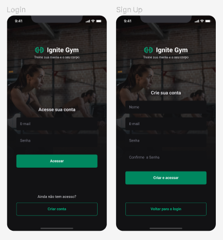
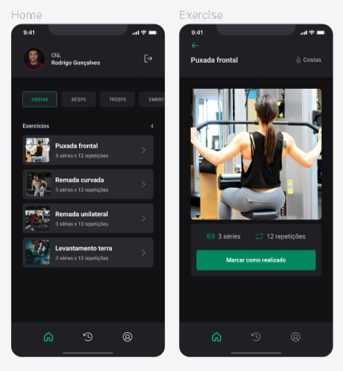

<h1>
  
</h1>

## 💻 Projeto

<h3 align="center">IgniteGYM trata-se de uma aplicação mobile disponível nas plataformas Android e IOS, com tutoriais de exercícios classificados por grupos musculares, sendo possível acompanhar o histórico completo dos treinos realizados, além de editar informações de perfil como foto, nome e senha.</h3>

## :camera: Demonstração

 

 

## :rocket: Tecnologias

- ✅ [React Native](https://reactnative.dev/)
- ✅ [Expo](https://expo.dev/)
- ✅ [TypeScript](https://www.typescriptlang.org)
- ✅ [NativeBase](https://nativebase.io/)
- ✅ [React Hook Form](https://www.react-hook-form.com/)
- ✅ [Yup](https://github.com/jquense/yup)
- ✅ [Context API](https://react.dev/reference/react/createContext)
- ✅ [Async Storage](https://reactnative.dev/docs/asyncstorage)
- ✅ [ESLint](https://eslint.org/)
- ✅ [Axios](https://axios-http.com/ptbr/docs/intro)
- ✅ [React Navigation](https://reactnavigation.org/)
- ✅ [React Navigation Native Stack](https://reactnavigation.org/docs/native-stack-navigator/)
- ✅ [React Navigation Bottom Tabs](https://reactnavigation.org/docs/bottom-tab-navigator/)
- ✅ [Expo Google Fonts](https://github.com/expo/google-fonts)
- ✅ [Phosphor Icons](https://phosphoricons.com/)
- ✅ [Expo Image Picker](https://docs.expo.dev/versions/latest/sdk/imagepicker/)
